<h1 align="center">Hi 👋, I'm Jonah Rothman</h1>
<h3 align="center">CS @ Boston University (B.A. + M.S. BA/MS Program)</h3>

  

- 🔭 I’m currently working on [TheTaskApp](https://github.com/jonahr4/TheTaskApp)

- 👨‍💻 All of my projects are available at [jonahrothman.com](jonahrothman.com)

<h3 align="left">Languages and Tools:</h3>

                             

  
  

