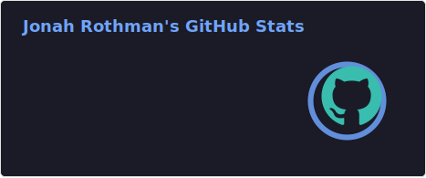
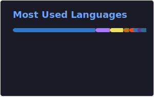

<h1 align="center">Hi 👋, I'm Jonah Rothman</h1>

  

<h3 align="center">
  Senior at Boston University in the BA/MS Computer Science program. 
  Recently focused on building real-world projects across web development, mobile applications, and web scraping to deepen practical engineering experience.
</h3>

 

<!-- Row 1: GitHub Stats + Most Used Languages (side by side, ~50/50) -->

&nbsp;

<!-- Row 2: Contribution / Activity Graph (full width, matches combined width above) -->

 

<h4 align="center">All of my projects are available at <a href="https://jonahrothman.com" target="_blank">jonahrothman.com</a></h4>
